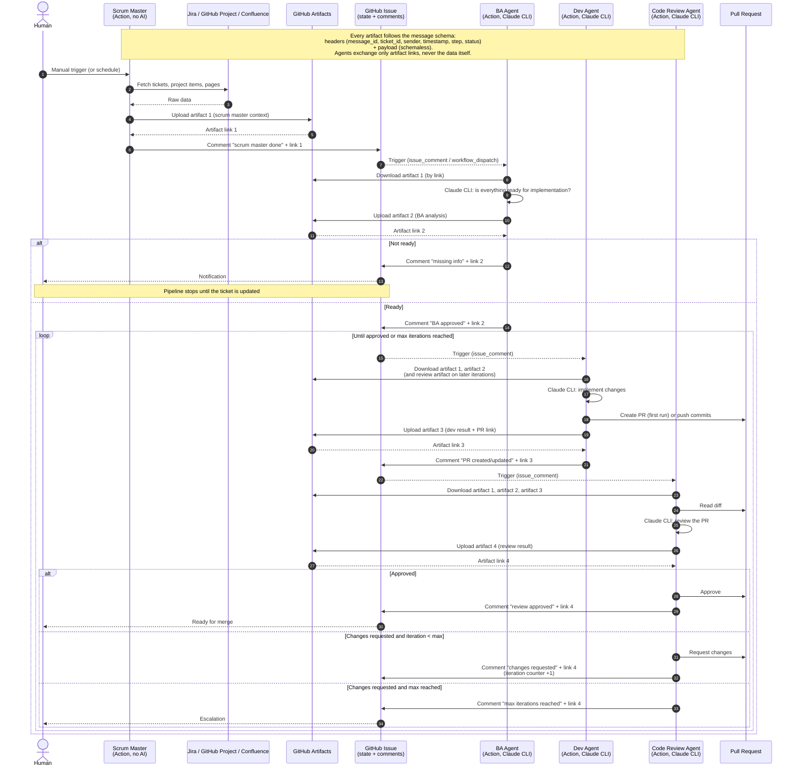

# DarkFactory

## Target flow

The diagram below is the final flow the project should eventually implement. It is the target state, not the current state.

```mermaid
sequenceDiagram
    autonumber

    actor Human
    participant SM as Scrum Master<br/>(Action, no AI)
    participant SRC as Jira / GitHub Project / Confluence
    participant ART as GitHub Artifacts
    participant ISS as GitHub Issue<br/>(state + comments)
    participant BA as BA Agent<br/>(Action, Claude CLI)
    participant DEV as Dev Agent<br/>(Action, Claude CLI)
    participant CR as Code Review Agent<br/>(Action, Claude CLI)
    participant PR as Pull Request

    Note over SM,CR: Every artifact follows the message schema:<br/>headers (message_id, ticket_id, sender, timestamp, step, status)<br/>+ payload (schemaless).<br/>Agents exchange only artifact links, never the data itself.

    %% Step 2.1 Scrum Master
    Human->>SM: Manual trigger (or schedule)
    SM->>SRC: Fetch tickets, project items, pages
    SRC-->>SM: Raw data
    SM->>ART: Upload artifact 1 (scrum master context)
    ART-->>SM: Artifact link 1
    SM->>ISS: Comment "scrum master done" + link 1

    %% Step 2.2 BA
    ISS-->>BA: Trigger (issue_comment / workflow_dispatch)
    BA->>ART: Download artifact 1 (by link)
    BA->>BA: Claude CLI: is everything ready for implementation?
    BA->>ART: Upload artifact 2 (BA analysis)
    ART-->>BA: Artifact link 2

    alt Not ready
        BA->>ISS: Comment "missing info" + link 2
        ISS-->>Human: Notification
        Note over Human,ISS: Pipeline stops until the ticket is updated
    else Ready
        BA->>ISS: Comment "BA approved" + link 2

        %% Step 2.3 Dev and 2.4 Review loop
        loop Until approved or max iterations reached
            ISS-->>DEV: Trigger (issue_comment)
            DEV->>ART: Download artifact 1, artifact 2<br/>(and review artifact on later iterations)
            DEV->>DEV: Claude CLI: implement changes
            DEV->>PR: Create PR (first run) or push commits
            DEV->>ART: Upload artifact 3 (dev result + PR link)
            ART-->>DEV: Artifact link 3
            DEV->>ISS: Comment "PR created/updated" + link 3

            ISS-->>CR: Trigger (issue_comment)
            CR->>ART: Download artifact 1, artifact 2, artifact 3
            CR->>PR: Read diff
            CR->>CR: Claude CLI: review the PR
            CR->>ART: Upload artifact 4 (review result)
            ART-->>CR: Artifact link 4

            alt Approved
                CR->>PR: Approve
                CR->>ISS: Comment "review approved" + link 4
                ISS-->>Human: Ready for merge
            else Changes requested and iteration < max
                CR->>PR: Request changes
                CR->>ISS: Comment "changes requested" + link 4<br/>(iteration counter +1)
            else Changes requested and max reached
                CR->>ISS: Comment "max iterations reached" + link 4
                ISS-->>Human: Escalation
            end
        end
    end
```
